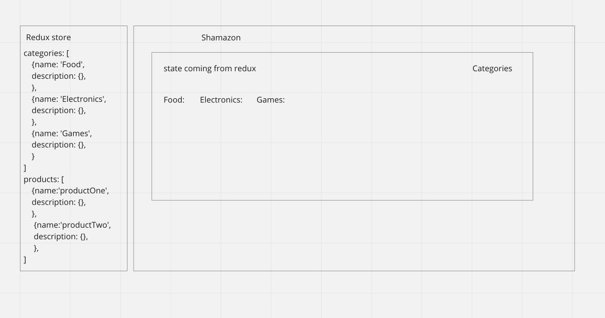

# Redux

## Feature Tasks

### Phase 1 Requirements

Today, we begin the first of a 4-Phase build of the storefront application, written in React. In this first phase, our goal is to setup the basic scaffolding of the application with initial styling and basic behaviors. This initial build sets up the file structure and state management so that we can progressively build this application in a scalable manner.

The following user/developer stories detail the major functionality for this phase of the project.

* As a user, I expect to see a list of available product categories in the store so that I can easily browse products.

* As a user, I want to choose a category and see a list of all available products matching that category.

* As a user, I want a clean, easy to use user interface so that I can shop the online store with confidence.

### Phase 3 Requirements

In phase 3, we will be connecting our Virtual Store to a live API so that our data is persistent and able to be separately managed.

The user stories from Phases 1 and 2 remain unchanged. For this phase, we are now adding the following new user stories to meet the new requirements.

As a user, I want to interact with live inventory so that I have confidence that the displayed products are in stock.
As a user, I want to know to that when I add an item to my cart, that it is removed from inventory so that no other users can purchase it.
Technical Requirements / Notes
And as developers, here are the high level development tasks that address the above end user requirements and workflow.

Continue to use Material UI Components for layout and styling.
Load the category and product list from a remote API on page load.
Update the product quantity in stock when adding items to (or removing from) the cart.
Continue to use multiple reducers.

## Phase 4 Requirements

In phase 4, we will be completing work on our Virtual Store by adding a two full page views to the application: Product Details and Checkout.

The user stories from Phases 1, 2 and 3 remain unchanged. For this phase, we are now adding the following new user stories to meet the new requirements.

As a user, I want to see a full detail view of a product so that I can make a more informed choice about purchasing it.
As a user, I want to view my full cart and initiate the checkout process so that I can purchase my items and have them delivered.
